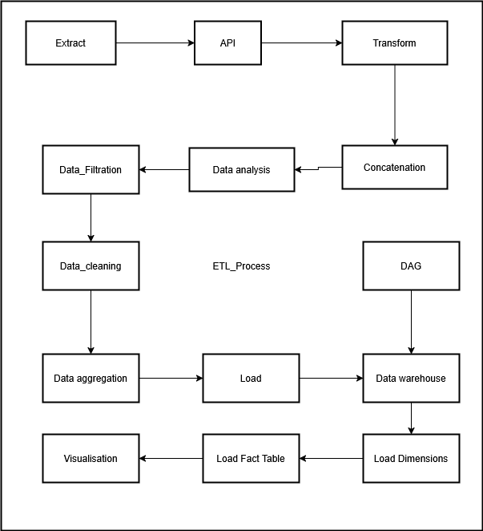

# ??🌐 World Bank Open Data API Pipeline e Dashboard


---
## 📖 Visão Geral

- **Objetivo**: Extrair, transformar e carregar dados do World Bank Open Data API para um banco de dados SQL Server, e criar um dashboard interativo com Power BI.
- **Dados**: Series temporais de indicadores econômicos globais.
- **Módulos**: Extrção, Transformação, Carregamento e Visualização.
- **Tecnologias**: Python, pandas, requests,Airflow,SQL Server, Power BI.

---

## 🚀 Getting Started

### 📋 Pré-requisitos

- Python 3.11 + pip  
- SQL Server Management Studio 20
- Docker (opcional, para executar o pipeline em contêineres)
- Power BI Desktop

### 🔧 Etapas
#### 1. Clonar o repositório

```bash
git clone <https://github.com/AndrePutoi/ETL_Project>
```

#### 2. Instalar dependências
```bash
pip install -r requirements.txt
```

#### 3. ALterar as variaveis da connecção ao SQL server nos ficheiros na pasta Load, e criar as tabelas a partir do data_warehouse.sql

---

## 📂 Estrutura do Projeto

```
ETL_Project/
├── config/
│   └── airflow.cfg
├── dags/
│   └── DAG_oparation.py
│   └── lista_paises_extraida.csv
├── Extration/
│   └── Extraction_scripts/
│       └── api_extraction.py
│   └── Get_Metadata/
│       ├── Generate_indicator_data.py
│       ├── Generate_location_data.py
│       └──  Generate_series_data.py
├── Load/
│   ├── SQL_code/
│       └── data_warehouse.sql
│   ├── Final_Filter.py
│   ├── Load_DimCountry.py
│   ├── Load_DimIndicator.py
│   ├── Load_DimTime.py
│   └── Load_Factindicators.py
├── Transformation/
│   ├── Concatination/
│       └── concatination.py
│   ├── Filtragem_process/
│       ├── Country_validation.py
│       └── Filtragem.py
│   ├── Final_Aggregation/
│       └── aggregation.py
│   ├── Interpolation_imputation/
│       ├── interpolation.py
│   └── Verification_Process
│       └── Country_verification.py
├── .env
├── docker-compose.yaml
├── extraction.log
├── transformation.log
├── load.log
├── README.md
├── requirements.txt
├── puglin/
├── ETL_diagram.png
└── PowerBI/
    └── World_Bank_Dashboard.pbix
```

---

## 📊 Executar o Pipeline

### Diagrama da Pipeline


### Executar a Extração
#### No terminal, execute o seguinte comando, para extração do metadados e dos dados:
```bash
python Extration/Get_Metadata/Generate_indicator_data.py
python Extration/Get_Metadata/Generate_location_data.py
python Extration/Get_Metadata/Generate_time_data.py
python Extration/Extraction_scripts/api_extraction.py
```
### Executar a Transformação
#### No terminal, execute o seguinte comando, para transformação dos dados:
```bash
python Transformation/Concatination/concatination.py
python Transformation/Verification_Process/Country_verification.py
python Transformation/Filtragem_process/Country_validation.py
python Transformation/Filtragem_process/Filtragem.py
python Transformation/Interpolation_imputation/interpolation.py
python Transformation/Final_Aggregation/aggregation.py
```

### Executar o Carregamento
#### No terminal, execute o seguinte comando, para carregar os dados no SQL Server:
```bash
python Load/Final_Filter.py
python Load/Load_DimIndicator.py
python Load/Load_DimCountry.py
python Load/Load_DimTime.py
python Load/Load_Factindicators.py
```

### Executar o Airflow
#### Inicie o Airflow no terminal:
```bash
docker compose up airflow-init
docker compose up -d
```
Acesse a interface do Airflow em `http://localhost:8080` e ative a DAG `DAG_oparation.py`.


### Visualizar no Power BI

Abra o arquivo `Economy_Dashboard.pbix` no Power BI Desktop e conecte-se ao banco de dados SQL Server onde os dados foram carregados. Você pode usar as tabelas `DimCountry`, `DimIndicator`, `DimTime` e `FactIndicators` para visualisar os dashboards interativas.

---

## 📊 Insights Macroeconômicos Globais

### 🌍 Indicadores Macroeconômicos Gerais

- **PIB per capita global:** USD 10.560 — valor moderado, refletindo disparidades regionais entre países desenvolvidos e em desenvolvimento.
- **Inflação global:** 33,27% — extremamente elevada, indicando possíveis desequilíbrios econômicos, como:
  - Crises cambiais
  - Instabilidades monetárias
  - Políticas fiscais frágeis
- **Comércio internacional (% do PIB):**
  - **Importações:** 45,93%
  - **Exportações:** 39,81%
  - 🔺 O mundo importa mais do que exporta, sugerindo um **déficit comercial agregado** global.

---

### 📈 Crescimento Econômico Global

- **Tendência volátil**, com quedas acentuadas:
  - 🟠 **2009** – Crise financeira global
  - 🔴 **2020** – Pandemia da COVID-19
- **Forte recuperação pós-2020**, associada a:
  - Estímulos governamentais
  - Reabertura econômica global

---

### 💰 Investimento e Despesa Pública por Continente

- **Europa:**
  - Maior despesa pública (~28% do PIB)
  - Maior formação bruta de capital (~37%)
- **Oceania:**
  - Alto nível de investimento público (~35%)
- **África e Ásia:**
  - Níveis mais baixos (~20–25%)
  - ⚠️ Sinalizam restrições orçamentárias ou baixa capacidade fiscal

---

### 🗺️ Distribuição do PIB per capita

- **Altos valores em:**
  - América do Norte
  - Europa Ocidental
  - Ásia Desenvolvida (Japão, Coreia do Sul)
- **Baixos valores em:**
  - África
  - Sul e Sudeste Asiático
- ➡️ Reflete **forte desigualdade econômica** global

---

### 🧾 Situação da Dívida Global

- **Dívida pública:** 60,15% do PIB — elevado, mas administrável
- **Dívida externa:** 61,75% do PIB — mostra dependência de financiamento estrangeiro
- **Curto prazo:** USD 830,32 bilhões — risco elevado de refinanciamento
- **Serviço da dívida:** 14,53% do PIB — reduz espaço para investimentos sociais

---

### 📈 Evolução da Dívida Pública (% do PIB)

- **Tendência crescente desde 2010**
- **Pico acima de 70% após 2020**, devido à:
  - Pandemia
  - Pacotes de estímulo e gastos emergenciais

---

### 🏦 Reservas Internacionais

- **China** lidera globalmente (~USD 2 trilhões)
- **Outros países com grandes reservas:**
  - Japão
  - Estados Unidos
  - Suíça
  - Arábia Saudita
- 🛡️ Indicam alta capacidade de defesa cambial e estabilidade financeira

---

### 🌎 Vulnerabilidades Regionais

- **África e América Latina**:
  - Altos níveis de dívida externa em relação ao PIB
  - ⚠️ Sugerem fragilidade fiscal e maior exposição a choques econômicos externos


---
## Melhorias futuras
- Implementar um melhor sistema de verificação de dados duplicados;
- Adicionar mais indicadores;
- Adicionar mais métricas de segurança e monitoramento;
- Melhorias na DAG em funcionamento;


